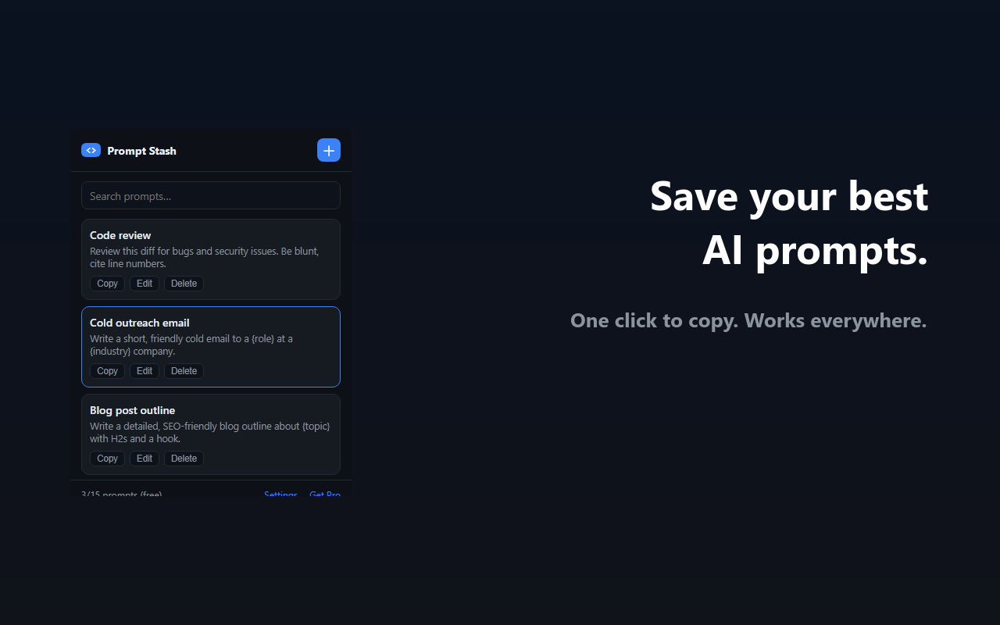

# 🗂️ Prompt Stash — Save & Reuse AI Prompts

A tiny, private Chrome extension that keeps your best AI prompts one click away. Save them, search them, copy any prompt instantly — then paste into ChatGPT, Claude, Gemini, or anywhere.

## Features

- 💾 Save prompts (15 free, unlimited with Pro)
- 📋 One-click copy
- 🔎 Instant search
- 🗃️ Folders + export/import (Pro)
- 🔒 100% private — everything stays in your browser (`chrome.storage.local`), nothing uploaded
- 🚫 No account, no sign-up

## Install (from source, dev mode)

1. Download / clone this folder.
2. Go to `chrome://extensions`, enable **Developer mode**.
3. **Load unpacked** → select this folder.

Or install from the Chrome Web Store (link coming once published).

## Pro

One-time unlock for unlimited prompts, folders, and export/import:
👉 https://alphaletgo.gumroad.com/l/prompt-stash-pro

## Tech

Plain Manifest V3 + vanilla JS. No build step, no dependencies. Easy to read and fork.

MIT licensed.
